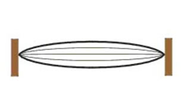

 

<iframe width="560" height="315" src="https://www.youtube.com/embed/hL2WUfhba3Y" frameborder="0" allow="autoplay; encrypted-media" allowfullscreen></iframe>
 

### What is an A.C. Sonometer?
 

An A.C sonometer is an apparatus by which the transverse vibrations of strings can be studied. It consists of two bridges, near the ends, one horse shoe magnet at the middle and at one end is a pulley. A string, often a copper wire, is fastened at one end that runs over the bridges and the pulley, and attached to a weight holder hanging below the pulley.Weights can be added to the holder to produce tension on the wire and the bridges can be moved to change the length of the vibrating section of the string.

## Theory:
 

Every object has a natural frequency of vibration. If kinetic energy is applied to an object at a rate that matches its natural frequency, resonance occurs and the object vibrates. In this experiment a small current, produced by a signal generator, causes the sonometer wire to move up and down due to interaction with the magnetic field of a U-shaped magnet. When the rate of movement due to the current matches the fundamental frequency of the wire, resonance occurs causing noticeable vibration.

 

To determine the frequency of a string first take a copper string and connect it to an A.C power supply. Then adjust the knife edges or the magnet to get the maximum vibration. This will be the frequency of the stretched string.

 

### Frequency of vibration of a stretched string:
 

  

 

The frequency is calculated using the equation,

$$f=\frac{1}{2L}\sqrt{\frac{T}{m}}................(1)$$

 

L = resonating length. 
T = tension at the string. 
m = mass/unit length of the wire.

#### Derivation of the equation:
 
Laws of transverse vibrations of stretched strings;

$$L = \frac{\lambda}{2} \quad \text{or} \quad \lambda = 2L$$

$$\text{But} \quad v = f\lambda \quad \text{or} \quad f = \frac{v}{\lambda}$$

$$\therefore \quad f = \frac{v}{2L}$$

$$\text{i.e.} \quad f = \frac{1}{2L} \sqrt{\frac{T}{m}}$$

### Law of length:
 

For a given string under constant tension, the frequency of vibration is inversely proportional to the length of the string.

$$\text{i.e.} \quad f \propto \frac{1}{L}$$

### Law of tension:
 

For a given string of constant length, the frequency of vibration is directly proportional to the square root of the tension.

$$\text{i.e.} \quad f \propto \sqrt{T}$$

### Law of mass:
 

For a string of constant length and under a constant tension, the frequency of vibration is inversely proportional to the square root of its mass per unit length. If $M$ is the mass and $L$ is the length of the string then;

$$m = \frac{M}{L} = \frac{\text{volume} \times \text{density}}{\text{length}} = \frac{\text{area} \times \text{length} \times \text{density}}{\text{length}}$$

$$\therefore \quad m = A \rho$$

If d is the diameter of the wire then;

$$A = \frac{\pi d^2}{4}$$

$$= \frac{1}{Ld} \sqrt{\frac{T}{\pi \rho}}$$

Substituting in equation (1) we get;

$$f = \frac{1}{2L} \sqrt{\frac{T}{\frac{\pi d^2 \rho}{4}}}$$

$$f = \frac{1}{Ld} \sqrt{\frac{T}{\pi \rho}}................(2)$$

The law of mass may be put into two additional laws, for strings of circular cross-section, as given below.

 

### Law of diameter:
 

For a string of a given material and length and under a constant tension, the frequency is inversely proportional to its diameter.

$$\text{i.e.} \quad f \propto \frac{1}{d}$$

### Law of density:
 

For a string of a given length and diameter and under constant tension, the frequency is inversely proportional to the square root of the density of the material of the string.

$$\text{i.e.} \quad f \propto \frac{1}{\sqrt{\rho}}$$

